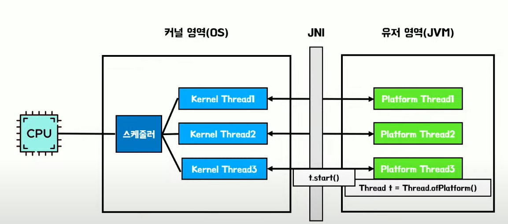

# 딥다이브 - Virtual Thread

### 프로세스

실행중인 프로그램 

### 스레드

프로세스 내에서 실행되는 실행 흐름 (작업 단위)

## Virtual Thread

2023년 JDK21에 추가된 경량 스레드이다. OS 스레드를 그대로 사용하지 않고 JVM 내부 스케줄링을 통해 수백만개의 스레드 사용이 가능하다.

### 장점

- 생성 및 스케줄링 비용이 저렴하다.
- Nonblocking I/O를 지원한다.
- 기존 스레드를 상속하여 코드가 호환된다.

## 전통적인 Java의 Thread

- Java에서는 OS Thread를 Wrapping 해서 사용한다.(Platform Thread)
- OS Thread는 생성 개수가 제한적이고, 생성, 유지 비용이 매우 비싸다.
    - 이러한 단점을 해결하기 위해 Thread Pool을 사용한다. (생성 비용이 비싸서)

전통적인 Java의 Thread를 사용하기 위해서는 JNI라는 Java Native Interface를 통해 커널 영역에 요청을 해야한다.

Java는 OS의 Kernel Thread를 Wrapping한 Platform Thread를 사용한다.

### 문제점

- Spring MVC WEB API 구조에서는 Thread per Request 형태이다. (요청 하나당 스레드 하나)
- I/O작업시 발생하는 Blocking으로 인해 대기 시간이 발생한다.
- 처리량을 높이기 위해서는 많은 스레드가 필요 (스레드 생성 개수가 제한적)

### 해결방안

- Webflux와 같은 Reactive Programming 적용
    - 스레드를 대기하지 않고 다른 작업을 처리할 수 있다.
    - 지원하지 않는 기능들이 많다.
    - 러닝커브가 매우 높다.

## Virtual Thread의 목표(?)

- 높은 처리량 확보
    - blocking 발생시 내부 스캐줄링을 통해 다른 작업 처리
- 자바 플랫폼과의 조화 (webflux는 기존 자바와 조화를 이루지 못했음)
    - 기존 스레드 구조를 그대로 사용 (Virtual Thread는 Java의 기존 Thread를 상속함)

즉, 기존 자바 구조와 조화를 이루면서 처리량을 높히고 싶다.

---

## Virtual Thread의 구조

- ForkJoinPool 스케줄러를 사용한다. Work Stealing 방식으로 동작한다.
- 각각 WorkerQueue를 가지고 있고, 본인의 Queue가 비어있으면 다른 Queue의 작업을 가저와서 진행한다.
- Virtual Thread는 커널 영역 접근 없이 Virtual Thread 생성, 스캐줄링이 가능하다.

### Continuation 작업 단위

- 실행 가능한 작업 흐름
- 중단 가능
- 중단한 지점 부터 재실행이 가능
    
    
    

Continuation의 yield를 통해 중단이 가능하고 중단된 지점에서 재실행이 가능하다.

Virtual Thread는 park 메서드를 통해 Continuation의 yield를 호출한다.

Thread가 Virtual Thread이면 기존의 park가 아닌 VirtualThread의 park를 호출한다.

만약 blocking 작업이 발생하면 기존 Thread는 Thread를 Block 하지만

Virtual Thread는 실제 스레드를 중단하지 않고 Continuation을 yield 해서 다음 Continuation을 실행해서 NonBlockingI/O 처럼 동작을 한다.

또한 작업을 교체하는 과정에서도 커널에 접근 없이 작업을 교체하기 때문에 컨텍스트 스위칭 비용이 낮다.

## Virtual Thread의 장점

### 1. Virtual Thread는 생성 비용이 작다.

- 기존 Thread
    - 메모리의 크기가 크다.
    - OS에 의해 스캐줄링된다 → 시스템 콜에 의한 오버헤드 발생
- Virtual Thread
    - 메모리가 작다
    - JVM에 의해 스캐줄링된다. (시스템 콜 X) → 오버헤드X

### 2. 기존 Thread를 상속한다.

- Thread를 사용하는 부분에 Virtual Thread 사용이 가능하다.
- 기존 Java 플랫폼과 조화를 이룬다.

### 3. NonBlocking I/O를 지원한다.

- Virtual Thread는 JVM을 이용해 스캐줄링을한다.
- Continuation을 활용한다.

### 일반 Thread

### Virtual Thread

### Virtual Thread 성능

Virtual Thread는 일반적인 Thread에 비해 I/O Bound 작업시 효율이 높다.

### 주의사항

- Synchronized, Native method 지양
    - 캐리어 스레드가 Block(pinning)이 되면 Virtual Thread 사용시 문제가 발생할 수 있다.
- ThreadLocal 사용을 신중히 해야한다.
    - Virtual Thread는 무한히 생성이 가능하기 때문에 (ThreadLocal을 가볍게, 쉽게 생성, 소멸)
- Pooling 사용시 오히려 병목이 발생할 수 있다.
- CPU Bound 작업(I/O Bound 반대)
    - nonblocking의 장점을 활용하지 못한다. (성능 낭비)
- 응답이 빠른것이 아니라 처리량은 높은것이다. (배압 조절 기능이 없다.)
    - 기존 스레드의 경우 스레드의 수로 인해 강제적으로 배압 조절이 되었다.
    - 하지만 Virtual Thread는 무제한의 생성이 가능하기 때문에 문제가 발생할 수 있다.
    - 유한한 리소스를 가지는 경우 배압조절이 필수적이다. (DB 커넥션)
    - 충분한 성능 테스트와 배압 조절이 필수적이다.

기존 Thread는 tomcat에서 대기를 했었는데 Virtual Thread는 JDBC 커넥션한테 전부 보내버려서

JDBC 커넥션을 기다리다가 TimeOut이 발생해서 Exception이 발생함

### 결론

- Virtual Thread는 가볍고, 빠르고 nonblocking이 가능한 경량 스레드이다.
- JVM 스케줄링과 Continuation을 통해 위와 같은 장점을 가능하게 만들었다.
- Thread per request를 사용중이거나, I/O blocking time이 주된 병목인 경우에 고려해 볼만한다.
- 쉽게 적용이 가능하다
    - Reactive 프로그래밍 또는 코틀린의 코루틴의 러닝 커브가 부담되는 경우

Virtual Thread는 기존 Thread의 대체가 아니라, 기다림에 대한 개선과 Java와의 조화가 목적이다.

Virtual Thread를 도입한다고 해서 무조건 처리량이 높아지는것은 아니다.

Virtual Thread가 Java의 동시성을 완전히 개선한것은 아니다. Virtual Thread는 Thread다.

### Reference

- https://www.youtube.com/watch?v=Q1jZtN8oMnU
- https://youtu.be/vQP6Rs-ywlQ?si=VeIjbYPjRhMeq6v8
- https://www.youtube.com/live/BZMZIM-n4C0?si=Bwy_k9R77_kkZWJh