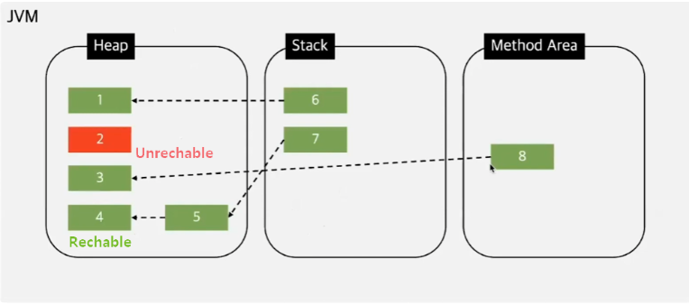

# 2주차(7/31) - Java & Spring

## **Java의 GC**

<aside>
💡 Garbage Collection이란?
Java의 메모리 관리 방법으로 JVM의 Heap 영역에 동적으로 할당된 메모리중 필요 없어진 메모리 객체를 자동으로, 주기적으로 제거 해주는 프로세스 이다.

</aside>

### GC의 장단점

- 장점
    - 메모리 누수를 방지 할 수 있다.
    - 이미 해제한 메모리를 다시 해체하거나, 해제한 메모리에 다시 접근하는 등의 오류를 방지 할 수 있다.
- 단점
    - 개발자 입장에서 메모리가 언제 해제 되는지 알 수 가 없다.
    - 오버헤드로 인한 성능 저하가 발생 할 수 있다.

### GC의 대상

그렇다면 어떤 객체가 GC의 대상이 될까?

객체는 현재 참조 되고 있는 Reachable 객체와 참조 되고 있지 않은 UnReachable 객체로 나누어 진다. GC는 이러한 UnReachable 객체들을 주기적으로 제거해준다.



### GC 알고리즘, GC 동작 과정, Stop The World

### finalize()

```java
@Deprecated(since="9")
protected void finalize() throws Throwable { }
```

finalize() 메서드는 Object 클래스에 정의되어 있는 메서드로, 객체가 GC에 의해 정리될 때 실행된다.

해당 메서드를 오버라이딩하면 GC의 대상이 되었을때 실행되며, 개발자가 의도한 기능을 수행하며 별도의 리소스 정리 작업을 수행한다. ( 하지만 JDK 9 버전에서 Deprecated 됨 )

finalize()를 오버라이딩한 객체는 큐로 이동되고 별도의 finalize 스레드가 해당 큐를 정리하면서 각 객체마다 정의된 finalize() 메서드를 호출하고 finalize가 종료되면 해당 객체는 진짜 GC에 의해 제거

- finalize() 를 수동으로 호출하는 것은 왜 문제가 될 수 있을까요?
    
    <aside>
    💡 finalize()은 JVM에서 자동으로 호출되도록 설계되었기 때문에 수동으로 호출할 경우 중복으로 호출될 수도 있으며 예상치 못한 동작이 발생하는 등의 다양한 부작용이 발생할 수도 있다. ( 또한 finalize()은 JDK 9 버전에서 Deprecated 됨 )
    
    </aside>
    
- 어떤 변수의 값이 null이 되었다면, 이 값은 GC가 될 가능성이 있을까요?
    
    <aside>
    💡 GC는 현재 참조되고 있지 않은 UnReachable 한 객체를 제거한다.
    어떤 변수의 값이 null이 되었다는 것은 해당 변수가 더 이상 객체를 참조하지 않고 있다는 것이다. 하지만 null이 된 해당 변수 외에 다른 변수가 해당 객체를 참조하고 있다면 해당 객체는 아직 Reachable 한 객체이므로 GC의 대상이 되지 않는다.
    
    </aside>
    

## **equals()와 hashcode()**

<aside>
💡 Java equals()와 hashcode()는 Java의 Object 클래스에 정의 되어 있다.
모든 객체는 기본적으로 Object를 상속받기 때문에 해당 메서드 사용이 가능하다.
또한 필요하다면 재정의를 통해 새로 작성 할 수 있다.

</aside>

```jsx
// Object equals
public boolean equals(Object obj) {
        return (this == obj);
}

// Object hashCode
// hashCode 메서드의 경우 Java가 아닌 JVM 내부의 네이티브 코드로 구현되어있다.
@IntrinsicCandidate
public native int hashCode();
```

### equals()

equals 메서드는 기본적으로 2개의 객체가 동일한지 확인할 때 사용된다.

기본적으로 equals 메서드는 두 객체가 참조하는 것이 동일 한지 확인한다.

따라서 객체의 참조가 아닌 객체의 데이터가 동일한지 확인하기 위해서는 equals 메서드를 오버라이딩하여 재정의해야 한다.

### hashCode()

hashCode 메서드는 Java가 아닌 JVM 네이티브 코드로 구현되어있다.

RunTime에 유일한 integer값을 반환한다.

1. hashCode()는 동일한 객체에 대해 항상 동일한 값을 반환해야 한다.
2. 두 객체가 equals 메서드로 동일하다면 반드시 두 객체의 hashCode() 값도 동일 해야 한다.
3. 두 객체가 equals 메서드로 동등하지 않다면 반드시 해시 코드가 다를 필요는 없다.

- 본인이 hashcode()를 정의해야 한다면, 어떤 점을 염두에 두고 구현할 것 같으세요?
    
    <aside>
    💡 1. equals 메서드가 재정의 되었는지 
    (equals가 재정의되지 않았다면 hashCode도 재정의 할 필요가 없다)
    2. equals 메서드에서 어떤 데이터들을 비교하는지
    (equals 메서드에서 두 객체가 동일하면 hashCode도 동일한 값을 반환해야한다)
    3. equals 메서드에서 어떤 데이터는 사용하지 않는지
    (equals에서 비교하지 않는 데이터를 hashCode에서 사용하면 equals로 동일한 객체의 hashCode 값이 다르게 나오는 경우가 발생할 수 있다.)
    
    요약: equals가 재정의 되었는지, equals에서 어떤 데이터는 비교하고 어떤 데이터는 비교하지 않는지
    
    </aside>
    
- 그렇다면 equals()를 재정의 해야 할 때, 어떤 점을 염두에 두어야 하는지 설명해 주세요.
    
    <aside>
    💡 1. hashCode()를 재정의 했는지
    (hashCode와 마찬가지로 equals재정의시 hashCode를 재정의 했는지 확인해야한다.)
    2. 어떤 필드값을 비교할것인지
    
    </aside>
    

## **IoC와 DI**

<aside>
💡 IoC(Inversion of Control)란?
제어의 역전은 객체의 생성과 의존성 관리를 개발자가 아닌 컨테이너나 프레임워크가 담당하는 것을 의미한다. ( 말 그대로 제어의 역전 )
전통적으로 객체는 필요한 의존 객체를 스스로 생성하거나 찾았지만, Ioc를 통해 객체의 생성, 초기화, 의존성 설정 등을 외부 컨테이너가 관리하게된다.

DI(Dependenct Injection)란?
의존성 주입은 컨테이너에 의해 클래스 간의 의존 관계를 자동으로 설정해주는 것을 의미한다. 의존 관계가 필요한 클래서에서 해당 의존 관계를 직접 생성하지 않고 외부에서 주입 받아 사용할 수 있다.

</aside>

### Spring Bean

스프링 빈이란 스프링 IoC 컨테이너가 관리하는 객체를 의미한다.

빈의 생명주기는 스프링 컨테이너에 의해 관리된다.

기본적으로 스프링 빈은 싱글톤 스코프로 관리된다. 필요에 따라 프로토타입 빈으로 설정할 수 있다.

### Ioc의 장점

- 모듈화 - 객체 생성과 의존성 관리를 외부 컨테이너가 담당하므로 모듈화가 용이하다.
- 유지보수 용이성 - 제어 흐름이 컨테이너에 의해 관리되어 코드의 복잡도가 감소하고, 유지보수가 쉬워진다.
- 테스트 용이성 - 외부에서 객체를 주입받으므로, 테스트 시 Mock 객체를 쉽게 주입할 수 있습니다.
- 재사용성 증가 - 다양한 설정에 따라 객체를 재사용할 수 있어 코드 재사용성이 높아집니다.

### DI의 장점

- 결합도 감소 - 클래스 간의 의존성을 줄여 코드 변경 시 영향을 최소화할 수 있다.
- 유연성 증가 - 의존 객체를 쉽게 교체할 수 있어 다양한 구현체를 사용할 수 있다.
- 재사용성 향상 - 의존성 주입을 통해 여러 클래스에서 동일한 객체를 재사용할 수 있다.
- 테스트 용이 - 의존 객체를 목(mock) 객체로 대체하여 단위 테스트를 쉽게 수행할 수 있다.
- 명확한 의존성 -의존 관계가 명확하게 드러나므로 코드의 가독성과 유지보수성이 향상된다,

### DI를 사용하지 않는다면


- 후보 없이 특정 기능을 하는 클래스가 딱 한 개하면, 구체 클래스를 그냥 사용해도 되지 않나요? 그럼에도 불구하고 왜 Spring에선 Bean을 사용 할까요?
    
    <aside>
    💡 구체 클래스를 사용해도되지만,
    단순히 객체를 생성하고 사용하는 것을 넘어서, 의존성 주입, 빈 생명주기 관리, 스코프 관리, AOP 지원, 모듈화, 테스트 용이성 등 다양한 이점을 제공하며
    이러한 기능들을 통해 유연성, 유지 보수성, 높은 확장성 등 다양한 이점이 있다.
    
    </aside>
    
- Spring의 Bean 생성 주기에 대해 설명해 주세요.
    
    <aside>
    💡 1. 컨테이너에서 설정파일과 어노테이션을 통해 빈을 정의한다.
    2. 컨테이너에서 정의된 내용을 바탕으로 빈의 인스턴스를 생성한다. (메모리 할당)
    3. 빈을 생성하고 필요한 의존성을 주입한다.
    4. 초기화 작업을 진행한다.
    5. 컨테이너에서 요청에 따라 빈을 반환해주고 어플리케이션은 빈을 사용한다.
    6. 어플리케이션이 종료되거나 빈이 더 이상 필요가 없으면 해당 빈을 소멸한다.
    
    </aside>
    
- 프로토타입 빈은 무엇인가요?
    
    <aside>
    💡 프로토타입 빈은 @Scope("prototype")를 통해 선언할 수 있다. 프로토타입 빈은 컨테이너에 빈에 대한 요청이 들어올때 마다 다른 인스턴스를 반환한다. (즉, 싱글톤으로 관리되는 빈이 아니다) 따라서 자신만의 상태를 가질 수 있다. (빈의 독립성 보장, 병렬처리와 스레드 안정성, 테스트 용이성)    
    </aside>
    

## **DispatcherServlet**

<aside>
💡 DispatcherServlet이란?
HTTP 프로토콜로 들어오는 모든 요청을 가장 먼저 받아 적합한 컨트롤러에 위임해주는 프론트 컨트롤러이다.

DispatcherServlet이 등장함에 따라 web.xml의 역할이 상당히 축소되었다.
과거에는 모든 서블릿을 URL 매핑을 위해 web.xml에 모두 등록해주어야 했지만, dispatcher-servlet이 해당 어플리케이션으로 들어오는 모든 요청을 핸들링해주고 공통 작업을 처리면서 상당히 편리하게 이용할 수 있게 되었다.

</aside>

### web.xml

web.xml은 Java EE 웹 애플리케이션의 배포 설명자 파일로, 웹 애플리케이션의 설정을 정의하는 XML 파일이다.

web.xml 파일을 통해 서블릿과 그 매핑 URL을 정의할 수 있다. 그 외에도 필터, 리스너, 에러 등 많은 설정이 가능하다.


- 여러 요청이 들어온다고 가정할 때, DispatcherServlet은 한번에 여러 요청을 모두 받을 수 있나요?
    
    <aside>
    💡 DispatcherServlet은 서블릿 컨테이너 내에서 동작하고, 서블릿 컨테이너(Tomcat)가 멀티쓰레딩을 지원하기 때문에 가능하다. (쓰레드풀 사용)
    
    </aside>
    
- 수많은 @Controller 를 DispatcherServlet은 어떻게 구분 할까요?
    
    <aside>
    💡 HandlerMapping을 통해 @RequestMapping을 기반으로 요청을 처리한 컨트롤러 메서드를 찾는다.
    
    </aside>
    

## **JPA와 같은 ORM을 사용하는 이유**

<aside>
💡 **JPA (Java Persistence API)란?**
JPA는 자바에서 사용하는 ORM(Object Relational Mapping) 기술 표준이다.

자바 애플리케이션과 관계형 데이터베이스 사이의 데이터 영속성을 관리하기 위한 표준화된 인터페이스를 제공하는 기술이다.

즉, JPA는 인터페이스이지 특정 기능을 제공하는 라이브러리가 아니다.

 JPA를 사용하려면 JPA를 구현한 ORM 프레임워크를 사용해야한다. 대표적인 JPA 구현체는 Hibernate, OpenJPA, EclipseLink등이 있다

**ORM이란?**

ORM 은 Object-Relational Mapping 의 약자로, 객체와 관계형 데이터베이스 간의 매핑을 자동화하는 기술이다.

객체지향프로그래밍은 클래스를 사용하고, 관계형 데이터베이스는 테이블을 사용한다.

이때 클래스와 테이블 사이에 모델 불일치가 생기는데 이를 해결해준다.

</aside>

### 영속성이란

영속성의 사전적 의미는 영원히 계속되는 성질이나 능력을 의미한다.

개발에서 영속성은 상태와 상관 없도록 물리적인 저장소를 이용해 데이터를 저장하는 행위를 의미한다.

- 영속성은 어떤 기능을 하나요? 이게 진짜 성능 향상에 큰 도움이 되나요?
    
    <aside>
    💡 영속성은 자동 동기화, 캐싱, 지연로딩, 트랜잭션 관리 등 다양한 기능을 한다.
    이를 통해 데이터베이스 접근과 트랜잭션 내 작업을 최소화 해서 성능을 향상 시킨다.
    
    </aside>
    
- N + 1 문제에 대해 설명해 주세요.
    
    <aside>
    💡 연간관계로 인해 발생하는 문제로 엔티티를 조회할때 한번의 쿼리로 해결할 수 있지만 여러번의 쿼리를 실행해 성능저하가 발생하는 문제를 말한다.
    
    문제의 원인은 엔티티를 조회하고 그와 관련된 엔티티를 모두 로드 하려고 하면, 
    처음에는 N개의 기본 엔티티를 로드 하지만 이후 각 기본 엔티티에 대해 연관된 엔티티를 각각 별도의 쿼리로 로드하게 된다.
    
    해결 방안으로는  Fetch Join, EntityGraph, Batch Size 등이 있다.
    
    </aside>
    

## **@Transactional**

<aside>
💡 트랜잭션이란?
데이터베이스의 상태를 변화시키는 하나의 논리적인 작업 단위를 구성하는 연산들의 집합

</aside>

### ACID, Commit, Rollback

### @Transactional(선언적 트랜잭션)

@Transactional은 스프링 프레임워크에서 제공하는 어노테이션으로, 메서드 단위로 트랜잭션을 관리할 수 있도록 도와준다. (Spring에서는 @Transactional을 AOP를 를 사용해서 구현한다)

JDBC 환경에서 수동 커밋과 비슷하지만 수동커밋의 경우 try catch를 통해 exception을 잡아서 rollback하는 코드를 작성해야하지만 @Transactional은 예외가 발생하면 자동으로 rollback을 해준다. (편리하다)

- @Transactional(readonly=true) 는 어떤 기능인가요? 이게 도움이 되나요?
    
    <aside>
    💡 @Transactional(readonly=true)는 해당 어노테이션을 읽기 전용으로 수행한다.
    1. 읽기 전용은 데이터 수정이 없기 때문에 경량화 된 락을 사용할 수 있다
    2. 최적화가 가능하고 의도치 않게 데이터가 변경되는것을 방지해준다.
    3. readonly는 CUD 작업이 없기 때문에 스냅샛 저장, 변경 감지 등의 작업을 수행하지 않아 성능이 향상된다.
    4. 데이터베이스 이중화 구성시 (master - slave) 읽기 전용으로 slave를 호출해 DB 서버 부하를 줄이고 최적화가 가능하다.
    5. 가독성 증가
    
    </aside>
    
- 그런데, 읽기에 트랜잭션을 걸 필요가 있나요? @Transactional을 안 붙이면 되는거 아닐까요?
    
    <aside>
    💡 위의 장점들이 있기때문에
    
    </aside>
