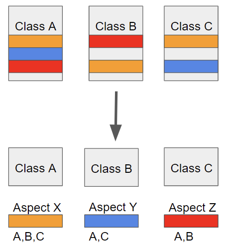

# 3주차(8/7) - Spring & Network

## AOP

<aside>
💡 AOP란? (Aspect Oriented Programing)
관점 지향 프로그래밍을 의미한다. (코드의 중복이 횡단으로 이루어지는 경우)
로깅, 보안, 트랜잭션 관리, 등과 같은 공통적인 관심사를 모듈화 하여 코드 중복을 줄일수 있다.

</aside>

Aspect(관점) - 공통 관심사항을 정의하는 모듈이다.

Advice(조언) - Aspect의 동작을 정의, 스프링에서는 5가지 종류의 Advice를 지원한다.

Pointcut (포인트컷) - 어떤 메서드가 어떤 Advice를 받을지 결정

Join Point(조인 포인트) - Advice가 적용될 수 있는 위치

Weaving(위빙) - 대상 코드에 Aspect를 적용하는것, 스프링에서는 컴파일, 클래스 로딩, 런타임 시점에 적용할 수 있다.

### Spring AOP

스프링 AOP는 Java에서 구현한 AspectJ와는 다르게 개발자들이 만날수 있는 문제들을 위한 간단한 기능을 제공한다. 프록시 패턴을 이용해서 AOP를 구현했다.

다양한 조인패턴을 지원하지 않고 메서드 레벨만 지원한다. 또한 위빙도 런타임시에만 가능하다.

Spring에서는 @Aspect 어노테이션을 사용해서 어드바이저를 쉽게 만들수 있다.

- @Aspect는 어떻게 동작하나요?
    
    <aside>
    💡 [https://devjem.tistory.com/54#[ %40Aspect를 사용한 프록시의 생성 및 동작 순서 ]  -1](https://devjem.tistory.com/54#%5B%20%40Aspect%EB%A5%BC%20%EC%82%AC%EC%9A%A9%ED%95%9C%20%ED%94%84%EB%A1%9D%EC%8B%9C%EC%9D%98%20%EC%83%9D%EC%84%B1%20%EB%B0%8F%20%EB%8F%99%EC%9E%91%20%EC%88%9C%EC%84%9C%20%5D%C2%A0%C2%A0-1)
    
    </aside>
    

## Java 에서 Annotation

<aside>
💡 Annotation이란?
사전적 의미는 주석이다.
메타데이터의 한 형태로, 코드에 추가적인 정보를 제공한다.

</aside>

### 표준 Annotaion

@Override, @Deprecated, @SuppressWarnings와 같이 자바에서 기본적으로 제공하는 Annotaion이다.

### 메타 Annotaion

Annotaion을 정의 할때 사용하는 Annotaion이다. 대표적으로 @Retention(유지되는 시점을 정의), @Target(적용될 수 있는 요소를 정의)등이 있다.

예를들어 @Service에는 bean을 등록하기 위해 @Component를 포함하고 있는데 이러한 경우에 @Component도 메타 Annotaion이다.

### 사용자 정의 Annotaion

필요한 경우 직접 Annotaion을 정의해서 사용한다. 

**장점**

- 코드 가독성 향상
- 유지보수 용이성 증가
- 코드와 메타데이터 분리

- 별 기능이 없는 것 같은데, 어떻게 Spring 에서는 Annotation 이 그렇게 많은 기능을 하는 걸까요?
    
    <aside>
    💡
    
    </aside>
    
- Lombok의 @Data를 잘 사용하지 않는 이유는 무엇일까요?
    
    <aside>
    💡 @Data 는 @ToString, @Getter, @Setter, @EqualsAndHashCode, @RequiredArgsConstructor을 모두 포함하는 어노테이션이다.
    1. @setter 남용
    2. @ToString 양방향 연관관계시 순환 참조 발생
    3. @EqualsAndHashCode가 equals()와 hashcode()를 자동으로 생성해서 문제가 발생할 수도 있다.
    4. @RequiredArgsConstructor 생성자로 객체 생성시 파라미터 위치가 변경되어서 오류가 발생 할 수 도 있다.
    
    결론: @Data를 사용하는 경우 equals, hashCode, 생성자만 직접 만들면 문제가 크게 발생하지는 않지만 주의해야할 부분이 많아 잘 사용하지 않는다.
    
    </aside>
    

## Tomcat

<aside>
💡 Tomcat이란?
아파치 톰캣(Apache Tomcat)은 아파치 소프트웨어 재단에서 개발한 서블릿 컨테이너(또는 웹 컨테이너)만 있는 웹 애플리케이션 서버이다.

</aside>

### 서블릿

서블릿은 웹 어플리케이션 내에서 HTTP 요청을 처리하고 동적인 웹 콘텐츠를 생성하는 Java 프로그램이다.

### 서블릿 컨테이너

서블릿 컨테이너는  WAS에 속해있으며, 서블릿의 생명 주기를 관리하고 HTTP 요청을 서블릿으로 전달한다.

### Web Server

- 클라이언트로 부터 HTTP 요청을 받아 정적인 웹페이지, 이미지, 스크립트 파일등을 제공하는 서버이다.
- 동적인 요청이 들어오면 해당 요청을 WAS에게 요청한다.
- Apache, Nginx, IIS 등이 존재한다.

### Web Application Server (WAS)

- 웹서버와 마찬가지로 HTTP 요청을 받아 처리할 수 있다.
- 정적 페이지 뿐만 아니라 동적 페이지도 처리가 가능하다.
- DB조회 와 같은 다양한 로직 처리가 가능하다.(데이터 처리)
- Tomcat, JBoss, WebLogic, WebSphere 등이 있다.

WAS는 정적, 동적 컨텐츠를 모두 처리 할 수 있는데 Web Server는 사용하지 않고 WAS만 사용해도 되는거 아닐까?

→ 정적 콘텐츠와 동적 콘텐츠 요청에 대한 책임을 분할하여 서버 부하를 방지해야한다. 즉, 정적 콘텐츠는 Web Server가, 동적 콘텐츠는 WAS가 담당한다.

`

- 혹시 Netty에 대해 들어보셨나요? 왜 이런 것을 사용할까요?
    
    <aside>
    💡
    
    </aside>
    

## HTTP에 대해 설명해 주세요.

<aside>
💡 HTTP란?
HyperText Transfer Protocol의 약자로 웹에서 클라이언트(브라우저)와 서버간의 데이터를 주고 받기위한 프로토콜이다. 주요 특징으로 stateless가 있다. (각 요청의 상태를 저장하지 않음)

</aside>

### HTTP 통신과정

1. **URL 입력후 해당 URL을 바탕으로 DNS를 조회하여 IP 탐색**
    - DNS 서버로 이동해서 해당 URL과 연결된 IP 주소를 알아낸다.
    - 캐시에 남아있다면 DNS 서버 이동X (시간 절약)
2. **IP를 찾아 해당 IP가 존재하는 서버로 이동**
    - 네트워크 레이어에서 길찾기 (IP) (여러 라우터를 지나 호스트로 이동한다.)
    - 이때, ARP를 이용해 MAC 주소 알아내 사용한다.
    - IP - 논리주소, MAC - 물리주소
3. **WEB 서버와 TCP 연결 시도 (3-way handshake)**
    1. web 서버와 TCP를 이용해 연결을 시도한다.
    2. 이때 3-way handshake 과정을 거친다.
        - 1. SYN: 클라이언트가 서버로 임의의 시퀀스 번호를 전달
        - 2. SYN-ACK: 서버는 클라이언트가 서버로 전달한 시퀀스에 1을 더하여 클라이언트로 전달
        - 3. ACK: 클라이언트는 서버에서 전달해준 시퀀스 + 1하여 다시 서버로 전달
        - SYN - 연결요청(임의의 시퀀스 번호를 같이 보낸다), ACK - 응답

4. **HTTP 메시지 송신 (클라이언트가 요청)**

- 3가지 부분으로 나누어진다
    - **Start line**
        - **method** - GET, POST, PUT, PATCH, DELETE 등 요청 방식
        - **path** - request가 전송되는 주소
        - **protocol** **version** - 해당 프로토콜 버전
    - **Header** - request에 대한 추가정보 (메세지 body의 길이, 인증 관련, 쿠키/세션 관련 등)
    - **Body** - 전송하는 데이터가 들어가는 부분

5. **HTTP 메시지 수신 (서버가 응답)**

- **Status Line** - 버전, 상태코드, 상태 메시지
    - 상태코드란?
        - HTTP 요청이 성공적으로 완료되었는지 알려준다. (정보응답 100, 성공응답 200, 리다이렉션 300, 클라이언트에러 400, 서버에러 500)
- **Header** - request와 동일, 단 response에서만 사용되는 값들이 존재한다.
- **Body** - 전송하는 데이터가 들어가는 부분

6. **통신 종료** (4-way handshake)

- TCP에서 3-way handshake를 이용해서 연결을 했지만 연결을 종료할때는 4-way handshake를 사용한다.
    - 1. FIN(finish): 클라이언트가 연결을 종료 하겠다는 FIN 플레그를 서버로 전달
    - 2. ACK: 서버는 클라이언트가 보낸 FIN을 잘 받았다는 ACK를 클라이언트에게 보내줌
    - 3. FIN : 서버는 close 준비를 하고 FIN을 클라이언트에게 전달
    - 4. ACK: 클라이언트가 마지막으로 ACK를 보내고 통신이 종료된다.

**연결시도는 3-way handshake 이지만 연결 종료 과정은 왜 4-way handshake일까?**

➨ Client가 데이터 전송을 마쳤다고 하더라도 Server는 아직 보낼 데이터가 남아 있을 수 있기 때문에 일단 FIN에 대한 ACK만 보내고, 데이터를 모두 전송한 후에 자신도 FIN 메세지를 보내기 때문이다.

- 공개키와 대칭키
    
    <aside>
    💡 공개키는 비대칭키이다. 비공개키는 대칭키이다.
    비공개키의 경우 서로 키를 공유하기 위해서 반드시 전송을 한번해야하는데, 이과정에서 키를 탈취당할 수 있다. 이를 보안하기위해 비대칭키 방식이 나왔다.
    비대칭키는 공개키와 비공개키가 존재한다.
    공개키로 암호화해서 데이터를 전송하고, 암호화된 데이터는 비공개키로만 복호화가 가능하다.
    통신하고 있는 사이트가 신뢰할 수 있는 사이트인지 알수 있는방법은?
    해당 사이트의 개인키로 암호화된 데이터를 전송하고 이는 해당 사이트의 비공개키로 복호화할 수 있다.
    즉, 다른사이트에서 데이터가 전달되면 공개키로 복호화가 되지 않는다.
    
    </aside>
    
- HTTPS Handshake 과정에서는 인증서 사용 이유
    
    <aside>
    💡 인증서 내부에는 서버의 공개키가 들어있다. 즉 이상한 서버의 공개키가 아닌 인증된 서버의 공개키를 받기 위해 인증서가 필요하다.
    HTTPS는 공개키(비대칭키)를 이용해서 대칭키를 전달하고, 대칭키를 통해 데이터를 암호화, 복호화하여 데이터 통신을 한다.
    HandShake 과정에서 인증서를 보내고 받은 인증서는 CA를 통해서 인증서가 진짜인지 확인이 가능하다.(CA의 개인키로 암호화 되어있음, 즉 CA의 공개키로 복호화를함)
    
    </aside>
    
- SSL과 TLS의 차이
    
    <aside>
    💡 SSL(Secure Sockets Layer)은 Netscape에서 개발한 초기의 보안 프로토콜이다.
    SSL 3.0이후로 TSL로 발전했다.
    TLS(Transport Layer Security)은 향상된 버전의 SSL이다.
    
    </aside>
    

## 웹소켓과 소켓 통신의 차이

### 웹소켓

웹소켓은 웹 클라이언트(브라우저)와 서버 간의 양방향 통신을 위한 프로토콜이다.

**HTTP**로는 **실시간 통신이 불가능**하고 **비연결성**, **연결을 맺는 과정의 비용이 높다**.

반면 **웹소켓**은 **연결지향**(양방향), **한번 연결을 하고 유지** 등의 장점이 있다.

하지만 웹소켓의 경우 HTML5부터 정식지원을 해서 이전 버전에서 사용이 불가능하다 또한 HTTP와 다르게 Stateful 하다.

HTTP에서 실시간 통신을 하려면 Polling, long polling, Streaming등의 방식이 존재하긴한다.

- 소켓과 포트의 차이
    
    <aside>
    💡 소켓은 IP 주소와 포트 번호로 구성된다.
    포트는 단일 장치내에서 실행되는 다른 프로그램을 구별하는데 사용하는 식별자이다.
    
    </aside>
    
- 여러 소켓이 있다고 할 때, 그 소켓의 포트 번호는 모두 다른가
    
    <aside>
    💡 포트 번호는 하나의 호스트에서 고유하지만, 하나의 프로세스는 여러개의 소켓을 생성 할 수 있기 때문에 같은 ip 같은 포트를 가지고 있더라도 여러개의 소켓이 존재할 수 있다.
    
    </aside>
    
- 사용자의 요청이 무수히 많아지면, 소켓도 무수히 생성되는지
    
    <aside>
    💡 사용자의 요청이 많아지면 소켓의 수는 증가하지만, 서버의 용량 등에 따라 생성되는 소켓의 수에 제한이 생길수 있다.
    
    </aside>
    

## TCP와 UDP

**TCP 특징**

- **연결 지향 방식**으로 **패킷 교환 방식**을 사용한다 (가상 회선 방식이 아님).
- **흐름 제어** 및 **혼잡 제어**.
    - 흐름제어 - 데이터 송신 속도와 수신 속도 조절(데이터 송신 속도가 더 빠를 경우 오버플로우가 발생할 수 있다.) stop and wait, sliding window 등이 있다.
    - 혼잡제어 - 네트워크 내의 패킷의 수가 넘치지 않게 조절 (마찬가지로 패킷이 너무 많아지면 해당 라우터가 처리하지 못해 오버플로우가 발생할 수 있다.)
- **UDP보다 속도가 느리다**. **높은 신뢰성**을 보장한다. **전송 순서 보장**
- **서버와 클라이언트는 1대1로 연결**된다.
- 전이중(Full-Duplex) - 전송이 양방향에서 동시에 가능 , 점대점(Point to Point) 방식.
    
    
    

**UDP 특징**

- **비연결형 방식**으로 **데이터그램 방식**을 사용한다.
- UDP헤더의 CheckSum 필드를 통해 **최소한의 오류만 검출**한다.
- TCP보다 **속도가 빠르다. 신뢰성이 낮다. 전송 순서가 변경될수 있다. 데이터 수신여부 확인X**
- **서버와 클라이언트가 N대M 연결 가능.**

- Checksum
    
    <aside>
    💡 데이터의 정확성을 검증하는 방법이다.
    
    </aside>
    
- TCP와 UDP 중 Checksum을 수행하는 프로토콜
    
    <aside>
    💡 TCP, UDP 모두 Checksum을 수행한다. (단 TCP는 필수, UDP는 선택)
    
    </aside>
    
- Checksum을 통해 오류를 정정 가능 유무
    
    <aside>
    💡 Checksum은 오류 발생 유무만 판단이 가능하다.
    
    </aside>
    
- TCP가 신뢰성을 보장하는 방법
    
    <aside>
    💡 3-way-handshake, 체크썸, 흐름제어, 혼잡제어, ACK와 재전송
    
    </aside>
    
- TCP의 혼잡 제어 처리 방법
    
    <aside>
    💡 AIMD(Additive Increase / Multiplicative Decrease), Slow Start (느린 시작), Fast Retransmit (빠른 재전송), Fast Recovery (빠른 회복)
    
    </aside>
    
- HTTP는 TCP를 사용하는 이유
    
    <aside>
    💡 신뢰성(오류검출, 혼잡제어, 흐름제어), 순서보장
    근데 이제 UDP도 사용하는거 아닌가?
    
    </aside>
    
- 브라우저가 서버가 TCP를 쓰는지 UDP를 쓰는지 어떻게 알 수 있는 방법
    
    <aside>
    💡 개발자 도구에서 request 헤더의 HTTP 버전 정보를 통해 알 수 있다.
    
    </aside>
    
- 본인이 새로운 통신 프로토콜을 TCP나 UDP를 사용해서 구현한다고 하면, 프로토콜 선택 기준
    
    <aside>
    💡 정확성이 중요한지, 속도가 중요한지에 생각해보고 각 프로토콜의 정점에 맞추어서 선택할 것이다.
    
    </aside>