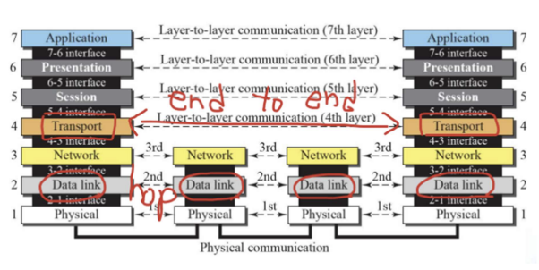

# 4주차(8/14) - Network

## **IP 주소는 무엇이며, 어떤 기능을 하고 있나요?**

### IP란

ip란  Internet protocol의 약자로 인터넷을 주고 받을때 사용되는 통신규약으로서 네트워크라고 하면 단골로 등장하는 OSI 7계층중 3번째 layer이다.

IP는 데이터를 패킷으로 나누어 전송하고, 받는쪽에서는 해당 패킷들을 다시 조립하여 원래의 데이터로 변화한다.

### IP주소란?

IP는 프로토콜이고, IP 주소는 IP 통신을 하기 위해 각 기기들을 구분하는 주소이다.

### **고정 IP 주소**

- 기기에 할당된 IP 주소가 변하지 않고 항상 동일한 주소를 가진다.
- 웹 서버, 이메일 서버 등 인터넷 서비스를 제공하는 기기에 사용된다.(안정적인 통신)

### **유동 IP 주소**

- 기기에 할당된 IP 주소가 일정 시간이 지나면 변경된다.
- 유동 IP 주소는 인터넷 서비스 제공자에 의해 임시호 할당된다.
- 유동 IP 주소는 IP 주소의 효율적인 관리와 부족한 IPv4 주소 자원의 활용에 도움이 된다.

### 질문

- **IPv4와 IPv6의 차이**
    - IPv4는 32비트로 구성된 IP주소로 대략 43억개의 주소 생성이 가능하다.
    - IPv6는 128비트로 구성된 IP 주소이다. IPv4의 개수가 부족해 더이상 할당이 되지 않아 이를 대체하기 위해 등장하였다.
- **수많은 공유기에서는 고정 주소를 제공하는 기능의 동작 방법**
    - 고정IP
- **IPv4를 사용하는 장비와 IPv6를 사용하는 같은 네트워크 내에서 통신하는 방법**
    - 서로 다른 주소 체계를 이용하기 때문에 직접적인 통신은 불가능하다. 하지만 중계 기능이 있는 라우터를 사용하면 통신이 가능하다.
- **IP가 송신자와 수신자를 정확하게 전송되는 것의 보장 유무**
    - .IP는 송신자와 수신자가 정확하게 전송하는 것은 보장하지만 패킷의 전송 여부나 중복 여부는 보장하지 않는다, 이러한 기능은 상위 레이어인 TCP에서 처리한다
- **IPv4에서 수행하는 Checksum과 TCP에서 수행하는 Checksum의 차이**
    - 두 체크썸 모두 데이터의 무결성을 검증하는 기능이다.
    - 하지만 IPv4에서 수행하는 Checksum은 헤더에 포함되어 헤더의 손상여부를 확인한다. (데이터는 확인하지 않음), 반면 TCP의 Checksum은 헤더뿐만 아니라 데이터의 손상까지 확인한다.
- **TTL(Hop Limit)**
    - TTL(time to live)은 무한루프 방지를 위해 사용하며 네트워크 문제로 패킷이 끝없이 순환하는것을 방지한다. 네트워크에서 패킷이 몇번의 홉을 거칠수 있는지 제한하는 값이다.
- **IP 주소와 MAC 주소의 차이**
    - IP 주소: 논리주소, 레이어 3 주소, 변경 가능, 길찾기에 사용됨  → 다른 네트워크와 통신할 수 있도록 도와줌
    - MAC 주소: 물리주소 , 레이어 2 주소, 변경 불가, 장치를 고유하게 식별하는데 사용됨

## **OSI 7계층**

- **Transport Layer와, Network Layer의 차이**
    - Transport Layer는 전송을 담당한다.
        - 주요 프로토콜로는 TCP와 UDP가 있다.
        - 주요기능: 데이터 분할, 전송, 조립, 흐름제어, 오류검정
    - Network Layer는 라우팅을 담당한다.
        - 네트워크 경로를 결정하고 패킷을 다른 네트워크에게 전달함 (간단하게 길찾기라고 생각하면 편하다)
        - IP: 패킷의 라우팅과 주소지정, 패킷 분할 및 재조립
        - ICMP: 네트워크 계층에서 발생하는 오류를 보고하고 진다함
- **L3 Switch와 Router의 차이**
    - Router는 L3에서 서로 다른 네트워크 간의 데이터 패킷을 라우팅하고 L2 Switch는 L2에서 패킷을 전달하는 장치를 의미했지만, L3 스위치와 라우터는 사실상 별 차이가 없다.

- **Layer는 패킷 명칭**
    - Physical Layer - bit
    - Data Link Layer - frame
    - Network Layer - packet
    - Transport Layer - datagram
- **각각의 Header의 Packing Order**
    - 
- **ARP**
    - ARP는 네트워크 계층(Layer 3)에서 사용되는 IP 주소를 데이터 링크 계층(Layer 2)에서 사용되는 MAC 주소로 변환하는 프로토콜이다.

## **3-Way Handshake**

1. SYN: 클라이언트가 서버로 임의의 시퀀스 번호를 전달
2. SYN-ACK: 서버는 클라이언트가 서버로 전달한 시퀀스에 1을 더하여 클라이언트로 전달
3. ACK: 클라이언트는 서버에서 전달해준 시퀀스 + 1하여 다시 서버로 전달

- **ACK, SYN 같은 정보 전달 방식**
    - SYN: 연결요청(임의의 시퀀스 번호를 같이 보낸다)
    - ACK - SYN에 대한 응답
- **2-Way Handshaking 를 하지 않는 이유**
    - 신뢰성과 안정성을 위해서 3-way Handshacking을 사용한다.
    - 잃어버린 패킷 문제, 반복 요청 문제등을 예방할 수 있다.
- **두 호스트가 동시에 연결을 시도했을 때 통신 연결 수행 방법**
- **SYN Flooding 에 대해 설명**
    - 서버는 클라이언트에게 ACK와 SYN을 전송한다. 그리고 서버는 클라이언트의 접속을 위해 메모리 공간을 확보해 놓는다.
    - 하지만 클라이언트가 서버에게 SYN만 보내고 서버의 응답에 대한 ACK를 보내지 않으면 서버의 메모리가 터저는 상황이 발생하는데 이를 SYN Flooding이라고 한다.
- [**www.github.com 을](http://www.github.xn--com-of0o/) 브라우저에 입력하고 엔터를 쳤을 때, 네트워크 상 어떤 일이 일어나는지**
    - 1. host 파일 확인
    - 2. DNS 캐시 확인 (기간 확인)
    - 3. DNS 서버를 통해 IP 주소 확인
    - 4. IP 주소를 알아낸 주소를 통해 TCP 연결을 한다.
    - 5. TCP연결을 성공하면 HTTP request를 보내고 response를 받는다.
- **DNS 쿼리를 통해 얻어진 IP가 가리키는 곳**
    - 해당 도메인 이름과 연결된 서버 주소이다.
- **Web Server와 Web Application Server의 차이**
    - Web Server
        - 클라이언트로 부터 HTTP 요청을 받아 **정적**인 웹페이지,이미지, 스크립트 파일등을 제공하는 서버이다.
        - 동적인 요청이 들어오면 해당 요청을 WAS에게 요청한다.
        - 아파치, 엔진엑스 등
    - WAS
        - 웹서버와 마찬가지로 HTTP 요청을 받아 처리할 수 있다.
        - 정적 페이지 뿐만 아니라 동적 페이지도 처리가 가능하다.
        - DB조회 와 같은 다양한 로직 처리가 가능하다.(데이터 처리)
        - Tomcat, JBoss, WebLogic, WebSphere 등이 있다.
    - WAS는 정적, 동적 컨텐츠를 모두 처리 할 수 있는데 Web Server는 사용하지 않고 WAS만 사용해도 되는거 아닐까?
        - 정적 콘텐츠와 동적 콘텐츠 요청에 대한 책임을 분할하여 서버 부하를 방지해야한다. 즉, 정적 콘텐츠는 Web Server가, 동적 콘텐츠는 WAS가 담당한다.
- **URL, URI, URN의 차이**
    - URI (Uniform Resource Identifier)
        - URI는 자원을 "**식별**"하는 데 필요한 모든 정보가 포함된 문자열이다.
        - URI는 URL과 URN을 포함한다.
    - URL (Uniform Resource Locator)
        - 리소스의 **위치**를 나타낸다.
    - URN (Uniform Resource Name)
        - 리소스의 **이름**을 나타낸다.
        
        
        

## **DNS**

DNS란 domain name system로 도메인 이름을 올바른 IP 주소로 찾아 이동시켜주는 역할을 한다.

DNS는 분산 데이터베이스 구조로 이루어져있다. 도메인의 dot(.)이 계층을 의미한다.

- **DNS는 몇 계층 프로토콜**
    - Application Layer로 7계층이다.
- **UDP와 TCP 중 사용하는 프로토콜**
    - UDP와 TCP 모두 사용한다. 각 프로토콜의 장단점을 바탕으로 선택
- **DNS Recursive Query, Iterative Query**
    - Recursive Query(재귀적 쿼리): 클라이언트가 서버에 질의할때, 최종적인 응답을 제공할때 까지 모든 필요한 작업을 서버에서 처리한다.(해당 DNS 서버에 클라이언트가 필요한 정보가 없으면 서버가 다른 서버에 요청한다.)
    - Iterative Query(반복적 쿼리): 서버가 자신이 알고있는 정보만 클라이언트에게 반환한다. 서버가 클라이언트의 요청에 대한 정보가 없으면, 다음에 요청을 해야하는 DNS 서버 주소를 반환해준다.
- **DNS 쿼리 과정에서 손실이 발생할 경우 처리 방법**
    - 일정시간동안 응답을 받지 못하면 타임아웃 처리를 한다.
    - 또한 일정 횟수동안 재시도를 한다.
    - 이러한 타임아웃, 응답 코드, 에러로그를 통해 손실이 발생 여부를 확인하고 처리를 한다.
- **캐싱된 DNS 쿼리가 잘못 될 경우 에러 보장 방법**
    - 캐싱된 DNS 쿼리가 잘못될 경우, 즉 캐시된 정보가 오래되었거나 잘못된 경우를 방지하기 위해서  TTL설정,
- **DNS 레코드 타입 중 A, CNAME, AAAA의 차이**
    - DNS 레코드란 DNS 서버가 패킷을 받았을때 어떤식으로 처리할지를 나타내는 지침이다.
    - 즉 DNS 상에서 도메인에 관한 설정을 하기 위해 사용되는 일련의 설정 문자이다.
    - A : 해당 도메인 주소가 가지는 IP (1:1)
    - AAAA: IPv6 버전의 A 레코드
    - CNAME: 별칭을 부여한 특정 도메인 주소
    - A를  사용하면 빠르지만, IP가 자주 변경되는 환경에서 번거로울 수 있다.
    
    
    
    
    
- hosts 파일의 역할과 DNS와 비교하였을 때 우선순위
    - host란 호스트 이름에 대응하는 IP주소가 저장되어 있어서 DNS에서 주소를 제공받지 않아도 서버의 위치를 찾게 해주는 파일이다.
    - 따라서 OS는 로컬의 host 파일을 먼저 확인한 뒤 host에 ip 주소가 없으면 DNS서버에 요청을한다. 즉, host 파일의 우선순위가 더 높다.

## **Stateless와 Connectionless**

HTTP의 주요 특징으로 stateless와 connectionless 가 있다.

### Stateless란?

- 서버가 클라이언트의 상태를 저장하지 않는 것을 말한다.
- 장점
    - 서버의 확장성이 좋다 (서버가 클라이언트의 상태를 저장하지 않기 때문)
- 단점
    - 클라이언트가 데이터를 계속 추가 전송해야한다.
- 한계
    - 모든것을 stateless로 구현하면 좋겠지만 이는 불가능하다.
    - ex) 로그인 상태 유지 → 쿠키 세션등을 이용한다.
    - 상태 유지는 최소한만!!

### Connectionless

Connection-oriented(연결 유지) 모델은 클라이언트의 요청 & 서버의 응답 이후에도 연결을 계속 유지하는 구조를 의미한다.

응답 이후에도 연결을 계속 유지하기 때문에 서버의 자원을 계속 소모한다.

### Connectionless란?

- 서버가 클라이언트의 요청에 응답을 한 이후에는 연결을 종료한다.
- 장점
    - 서버 자원을 효율적으로 사용할 수 있다. (연결을 끊기 때문에)
- 단점
    - TCP/IP 연결을 계속 새로 맺어야 한다 → 3-way handshake를 계속 해야한다.

- **HTTP는 Stateless 구조를 채택 이유**
    - Stateless란 무상태성이라는 뜻으로 서버가 클라이언트의 상태를 저장하지 않는것이다.
    - 서버가 클라이언트의 상태를 저장하지 않기 때문에 시스템 확장에 유리하다.
        - 언제든 새로운 인스턴스를 추가 할 수 있다.
- **Connectionless의 성능 해결 방법**
    - 클라이언트와 서버가 한 번 연결을 맺은 후, 클라이언트 요청에 대해 서버가 응답을 마치면 맺었던 연결을 끊어 버리는것을 의미한다. → 성능이 좋지 않다
    - UDP를 사용하여 HTTP를 구현한 QUIC 프로토콜 같은것이 존재한다.
- **TCP의 keep-alive와 HTTP의 keep-alive의 차이**
    - tcp keep-alive는 connection을 지속적으로 얼마나 유지하느냐에 초점을 맞추고 http 에서의 keep-alive는 최대 얼마동안 connection을 유지할 것인가가 다르다.