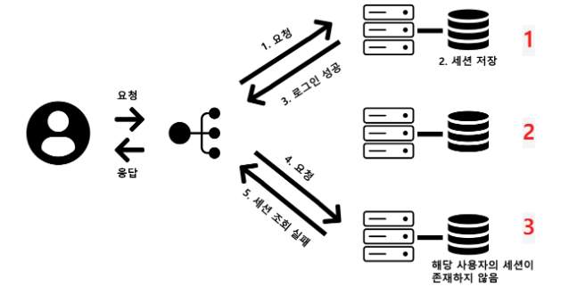

# 7주차 - ETC

## **쿠키와 세션의 차이에 대해 설명**

### 쿠키

쿠키란 **클라이언트 측에 저장**되는 작은 데이터 조각으로, 사용자가 웹사이트를 방문할 때마다 서버로 전송된다.

### 세션

세션은 **서버측에서 사용자의 정보를 저장**하는 방식으로 서버은 클라이언트에게 고유한 세션를 만들어 할당해준다.

### 쿠키와 세션의 차이점

1. 위에서 언급했듯이 쿠키와 세션의 가장 큰 차이점은 데이터가 저장되는 위치이다.
   (쿠키 - 클라이언트, 세션 - 서버)
   쿠키는 클라이언트와 서버가 데이터를 주고 받기 위해 사용되는 작은 저장소?
2. 쿠키는 삭제하지 않는 한 무제한으로 저장되지만, 세션은 설정한 시간이 지나면 종료된다.

### stateless

stateful은 서버가 클라이언트의 이전 상태를 보존한다는 의미이다. 반대로 무상태(stateless)는 서버가 클라이언트의 이전 상태를 보존하지 않는다는 의미이다.

HTTP는 stateless 특징을 가진다. 이는 클라이언트의 상태를 보존하지 않아 클라이언트의 요청에 어느 서버가 응답해도 상관이 없다. 따라서 클라이언트의 요청이 대폭 증가해도 서버를 증설해 해결할 수 있다.

사용자의 정보를 서버가 저장하지 않기 때문에 클라이언가 지속적으로 추가 정보를 전송해야 한다.

하지만, 이전 상태를 보존하지 않기 때문에 단순히 로그인만 보더라도 사용자가 로그인한 상태를 서버에 유지시켜 주어야 한다. 이 경우에는 브라우저 쿠키나 서버 세션 등을 사용해 상태를 유지

### 질문

- 세션 방식의 로그인 과정
  - 사용자 데이터를 전송하고 로그인을 한다.
  - 서버에서 해당 정보를 확인하고 세션을 생성하고 ID를 발급한다.
  - 세션 ID를 쿠키에 넣어서 클라이언트와 서버가 통신할때 사용한다.
  - 세션 ID를 통해 해당 사용자가 인증된 사용자임을 증명할 수 있다.
- HTTP의 특성인 Stateless
  - 위에 있음
- Stateless의 의미를 살펴보면, 세션은 적절하지 않은 인증 방법이지 않은지
  - 세션 방식은 이에 반하긴 하나 현대의 웹 서비스들은 불가피하게 상태를 유지해야하는 경우가 많으며 Stateless를 유지하기 위해 요청마다 필요한 정보를 모두 담아 통신하는게 부하와 cost가 더 클 수 있어 사용한다.
  - 단순히 HTTP가 stateless한 특징을 가지고 있다고 생각하자. HTTP가 stateless 하기 떄문에 로그인을 구현하기 위해 쿠키와 세션을 사용하는것
- 규모가 커져 서버가 여러 개가 됐을 때 세션 관리 방법
  - 서버가 여러개가 되었을 경우에 a 서버에서 로그인해서 생긴 세션이 b 서버에 존재하지 않아 문제가 발생 할 수도 있다.
    - 로그인을 한 서버에서만 처리한다. (스티키 세션)
      - 과부하, 로그인 서버가 다운되면 모든 세션이 초기화
    - 세션 클러스터
      - 세션이 생성되면 다른 서버에 해당 정보를 복제함
      - 서버 다운시 문제가 발생할 수 있는 스티키 세션의 단점은 해결할 수 있지만
      - 메모리 문제
    - 세션 스토리지
      - 세션 정보를 저장하는 저장소 생성
  
  https://creeraria.tistory.com/38

## **HTTP 응답코드에 대해 설명해 주세요.**

### HTTP 응답 코드란?

서버가 클라이언트의 요청에 대해 응답하는 방식을 나타내는 숫자 코드

### 질문

- 401 (Unauthorized) 와 403 (Forbidden)의 의미적인 차이
  - 401은 인증이 필요한것, 403은 해당 요청을 수행할 권한이 없는것 - 인증과 인가의 차이
- 200 (ok) 와 201 (created) 의 차이
  - 200은 GET 요청에서 요청한 데이터를 성공적으로 가져온 경우
  - 201은 POST 요청을 통해 새로운 리소스가 생성된 경우
- 필요하다면 저희가 직접 응답코드를 정의해서 사용할 수 있는지
  - 가능은 하지만…

## **HTTP Method 에 대해 설명해 주세요.**

### 멱등성이란?

같은 요청을 여러번 날렸을 때 서버의 상태가 유지되어야 하는 성질

```json
PUT /posts/ HTTP/1.1 ⭢ 해당 요청을 100번 날려도 서버의 상태는 유지되지만 ⭢ 멱등

POST /posts/1 HTTP/1.1 ⭢ POST를 100번 보내면 데이터가 100개가 생성된다 ⭢ 멱등X
```

**PUT과 PATCH 모두 수정이지만 왜 PATCH는 멱등하지 않을까?**

- PUT은 해당 리소스를 완전히 교체해 버리기 때문에 멱등이지만
- **PATCH는 멱등으로 설계할 수도 있지만, 멱등이 아니게도 설계할 수 있기 때문이다.**
  - **ex)** 한번 호출 할때 마다 나이를 10씩 더하는 경우 ⭢ **멱등X**

### 질문

- HTTP Method의 멱등성
  - GET, PUT, DELETE **⭢멱등**
  - POST, PATCH **⭢멱등X**
- GET과 POST의 차이
  - GET: 일반적으로 데이터 조회시 (전송도 이제는 가능은 하다), 멱등성
  - POST: 데이터 전송, 멱등성X, 보안 적합
- POST와 PUT, PATCH의 차이
  - **POST**는 데이터를 **생성**하고
  - **PUT**은 해당 정보의 **전체를 수정**,
  - **PATCH**는 해당 정보의 **부분을 수정**한다.
  - 하지만 **PUT**은 요청 리소스가 없다면 생성할수 있다.
    - 리소스가 존재 -> 수정
    - 리소스가 존재안함 -> 생성
- HTTP 1.1 이후로, GET에도 Body에 데이터를 실을 수 있게 되었음에도 왜 아직도 이런 방식을 지양하는가
  - 보안 문제가 발생 할 수 있다.
    - 캐싱으로 인한 데이터 노출
    - 브라우저 보안 정책으로 지원도 안함 (CSRF 취약)

## **인터럽트**

인터럽트(Interrupt)는 컴퓨터 시스템에서 실행 중인 프로그램을 잠시 멈추고, 특정 이벤트나 상황을 처리하기 위해 운영체제나 하드웨어가 개입하는 것을 의미한다.

인터럽트가 발생하면 현재 실행중인 작업을 멈추고 인터럽트 핸들러(Interrupt Handler)나 서비스 루틴(Service Routine)을 실행하여 해당 이벤트를 처리한 후, 중단된 작업을 이어서 실행합니다.

### 질문

- 하드웨어 인터럽트 vs 소프트웨어 인터럽트
  - 말 그대로 하드웨어(키보드, 마우스)등에 의해서 발생하는 것
  - 소프트웨어는 시스템콜이나 예외처리등에 사용된다.
- 인터럽트 처리 방식
  - 인터럽트 발생, 신호 전달, 작업 저장, 핸들러 실행, 처리
- Polling 방식
  - 폴링이란 CPU가 주기적으로 각 장치의 상태를 검사하여 이벤트가 발생했는지 확인하는 방식을 의미한다,
- 동시에 두 개의 인터럽트가 발생한다면?
  - 동시에 2개의 인터럽트가 발생하면 우선 순위처리가 매우 중요하다. 우선순위가 높은 인터럽트를 먼저 처리한다.

## **프로세스**

### 질문

- 프로세스 vs 스레드
  - 프로세스는 실행중인 프로그램을 의미한다.
  - 스레드는 프로세스 내에서 실행되는 작업 단위이다.
- PCB
  - process control block
  - 운영체제가 각 프로세스를 관리하기 위해 사용하는 데이터 구조로 프로세스에 대한 중요한 정보를 저장 (PID, 상태, CPU 레지스터 기타 등등)
- 리눅스에서 프로세스와 스레드의 생성 방법
  - 프로세스 생성: fork() 시스템 호출을 통해 부보 프로세스의 복사본으로 자식 프로세스 생성
- 데몬 프로세스
- 자식 프로세스가 상태를 알리지 않고 죽거나 부모 프로세스가 먼저 소멸된다면?
  - 자식 프로세스가 상태를 알리지 않고 죽으면 좀비 프로세스가 된다.
    - 좀비프로세스는 종료된 상태이지만 아직 OS가 인지하지 못해 PCB에 메모리가 남아있다,
  - 부모 프로세스가 먼저 소멸되면 자식 프로세스는 고아 프로세스가 된다.
    - 고아 프로세스는 자동으로 init 프로세스 PID 1로 재부모화 되어 init이 자식 프로세스의 종료 상태를 수집하고 처리한다.
- 리눅스에서 프로세스 트리의 루트 노드에 위치하는 프로세스
  - init 프로세스
  - 부팅시 제일 먼저 실행되며 모든 프로세스의 상위 부모이다.
